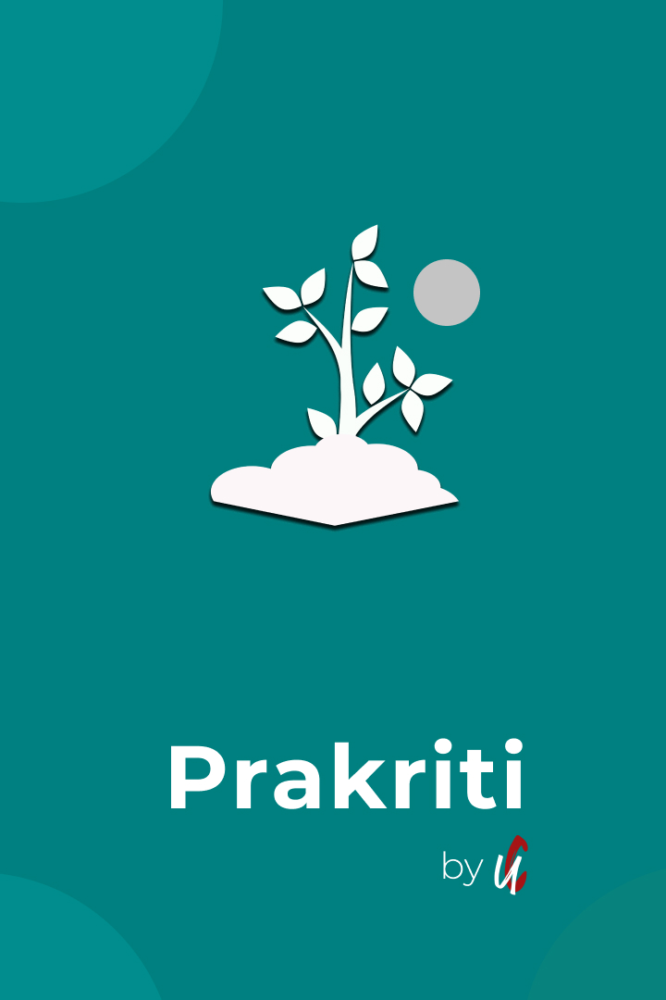
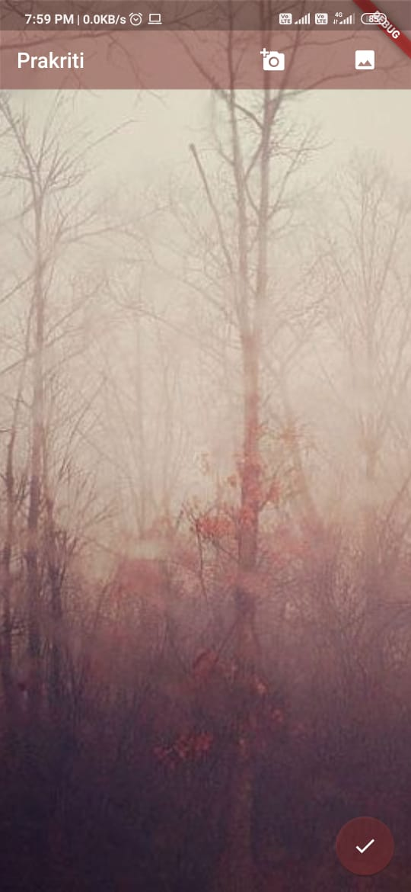
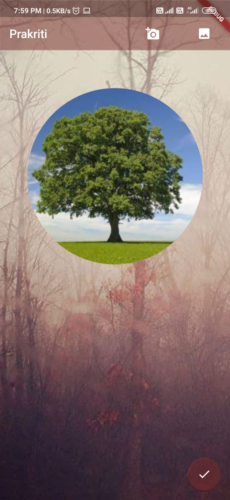
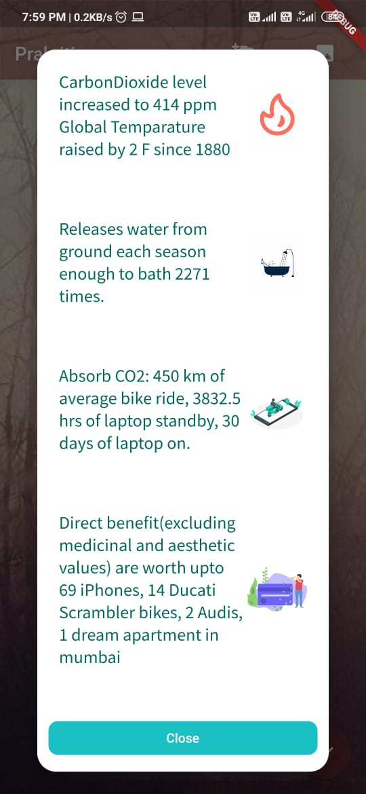
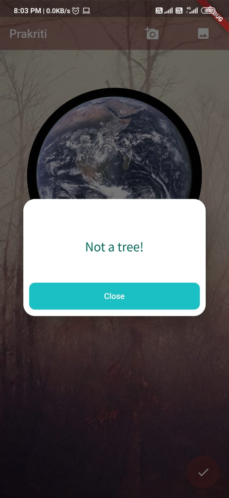

# PRAKRITI: OUR PLANET
A Flutter application | ML kit | API Intigration
NASA SPACECHALLENGE 2020
## Every small thing we do has an impact directly on the planet and life on it. Trees provide oxygen for us to breathe, and they are being cut down each day. We have a very little idea of what a single Tree can do, how much does a single Tree has an impact on us. We are looking forward to making the future, as well as the present generation aware of how can a single tree have a direct impact on us by comparing the benefits with materialistic things that most people can understand nowadays. Due to lack of time and experience, we couldn't implement it the way we wanted in terms of beautification and AR thing, however, it does serve it's basic purpose and shall be able to spread awareness.

## APP LINK: https://drive.google.com/file/d/1wIlACAlDZbgUvauU6Xjd-hbp9R7fvUDc/view?usp=sharing
## Demo video Link: https://drive.google.com/file/d/1wsbjLVjf_Rre3s7cww6O7C_xJFc6gADT/view?usp=sharing

## Screenshots of the App

## Click on the top right to import an image either from camera or internal storage

## Image recognized as tree

## Results shown

## Not a tree

